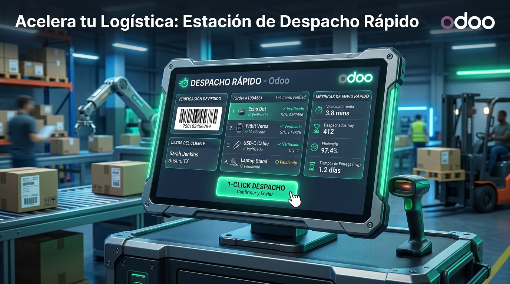
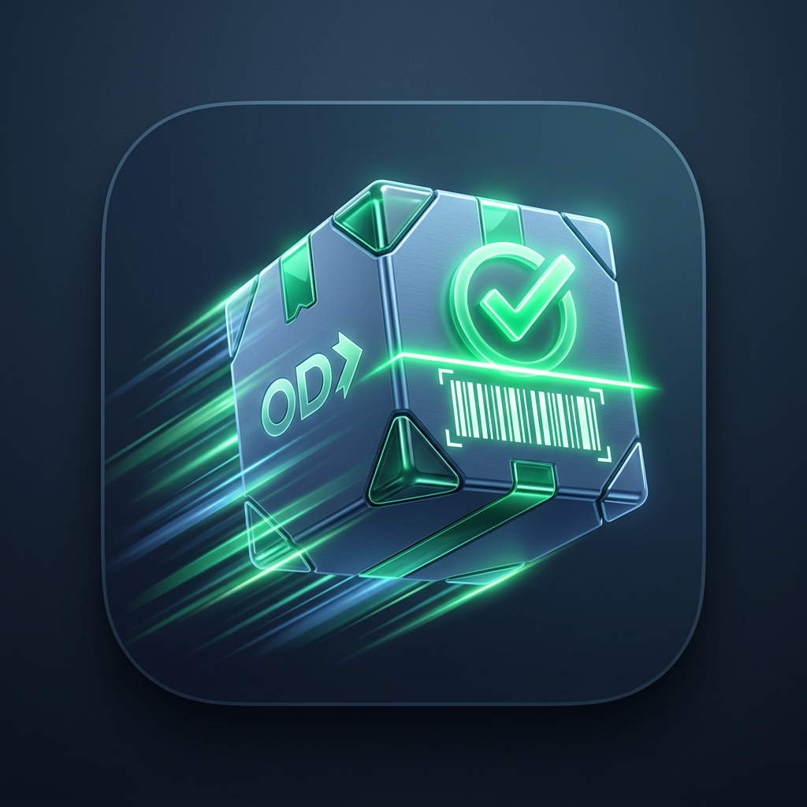

# 📦 Estación de Despacho Rápido Pro (`fast_dispatch_station`)

  

**Autor:** Omar Martinez  
**Licencia:** OPL-1  
**Versión:** 19.0.1.3.0  
**Categoría:** Inventario / Logística y Despacho  
**Precio Oficial:** $299 USD  

---

## 📌 ¿Qué Hace este Addon?

El módulo **Estación de Despacho Rápido Pro** proporciona una pantalla táctil industrial de alta velocidad para la auditoría, empaque y validación inmediata de pedidos de venta e inventario en **Odoo 19**.

Está diseñado para mesas de empaque, mostradores de despacho y líneas de salida de mercancía en almacenes de alto tráfico comercial.

---

## ⚙️ ¿Cómo Funciona Paso a Paso?

1. 🔍 **Escaneo del Pedido o Albarán:**
   - El operador escanea el código de barras del Pedido de Venta (`SO...`) o de la Orden de Entrega (`WH/OUT/...`).
2. 📦 **Despliegue Táctil de Artículos Requeridos:**
   - La pantalla muestra los productos solicitados en el pedido con su cantidad requerida e imagen.
3. ⚡ **Verificación por Código de Barras en Tiempo Real:**
   - El empacador escanea artículo por artículo físico introducido en la caja.
   - El sistema cambia las insignias a verde (**VERIFICADO**) con feedback auditivo y visual. Si se escanea un producto incorrecto, emite una alerta roja instantánea.
4. 🚀 **Validación en 1-Click:**
   - Una vez verificado el 100% de la mercancía, el operador presiona el botón **1-Click Despachar**, el cual valida automáticamente la transferencia de inventario (`stock.picking`), descuenta el stock y marca la entrega como realizada.

---

## 🚀 ¿Cómo Beneficia a la Empresa?

* **🛡️ 0% Errores de Empaque:** Garantiza que ningún paquete salga del almacén con productos faltantes, trocados o equivocados.
* **⚡ Incremento del +300% en Velocidad de Salida:** Permite despachar decenas de paquetes por hora por estación sin escribir ni hacer búsquedas manuales.
* **💰 Ahorro Masivo en Costos Logísticos:** Elimina devoluciones de clientes, costos de flete por reenvío y reclamos por falta de mercancía.
* **📱 Optimizado para Pantallas Táctiles & Lectores Pistola:** Diseñado con botones gigantes táctiles y compatibilidad con cualquier lector de código de barras USB/Bluetooth o inalámbrico.

---

## 📸 Recursos Gráficos Incluidos (`static/description/`)

- 🖼️ **Portada Principal App Store:** [`static/description/icon_banner.png`](static/description/icon_banner.png) *(Banner Glassmorphism 16:9)*
- 🎨 **Banner Ilustrativo:** [`static/description/banner.png`](static/description/banner.png) *(Imagen gráfica secundaria)*
- 📱 **Icono PNG:** [`static/description/icon.png`](static/description/icon.png) *(Icono de Alta Resolución)*
- 📐 **Icono SVG:** [`static/description/icon.svg`](static/description/icon.svg) *(Vector SVG para escalado)*
- 🌐 **Ficha HTML App Store:** [`static/description/index.html`](static/description/index.html) *(Vista comercial responsive para Odoo Apps)*
