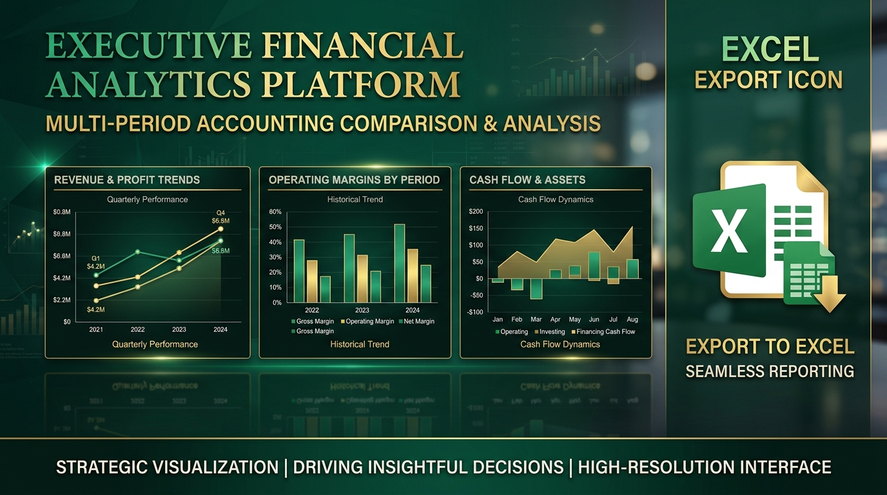

# 📈 OM Dynamic Financial Reports PRO

## 1. 📌 ¿Qué Hace?
Extiende el motor financiero agregando comparativa multi-período (Mensual, Trimestral, Anual) y exportación nativa a **Microsoft Excel (.xlsx)** con fórmulas contables dinámicas y diseño ejecutivo.

## 2. ⚙️ ¿Cómo Funciona Paso a Paso?
1. Abre el asistente **Reportes Financieros PRO**.
2. Selecciona el tipo de comparativa (Ej: Comparar Q1 vs Q2 vs Q3).
3. Presiona **Exportar a Excel (.xlsx)**.
4. El sistema compilará la hoja de cálculo estilizada con totales, agrupaciones de cuenta y encabezados institucionales para presentar a la junta directiva.

## 3. 💼 ¿Cómo Beneficia a la Empresa? (Valor Comercial)
* **Presentaciones Ejecutivas en 1-Clic:** Genera informes listos para auditorías financieras y comités directivos.
* **Análisis de Tendencias:** Facilita la detección temprana de incrementos de costos de operación entre trimestres.
* **Formatos Estándar de Industria:** Permite exportar a Excel sin romper enlaces ni fórmulas de amortización.
